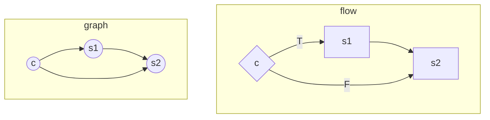
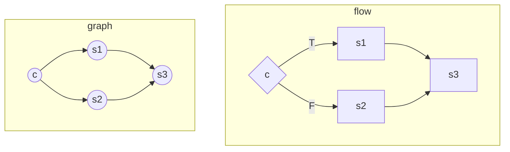
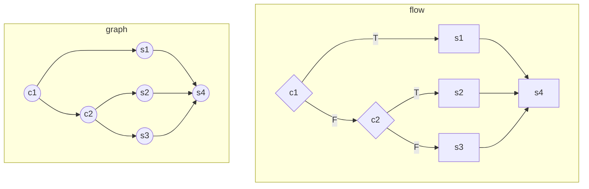
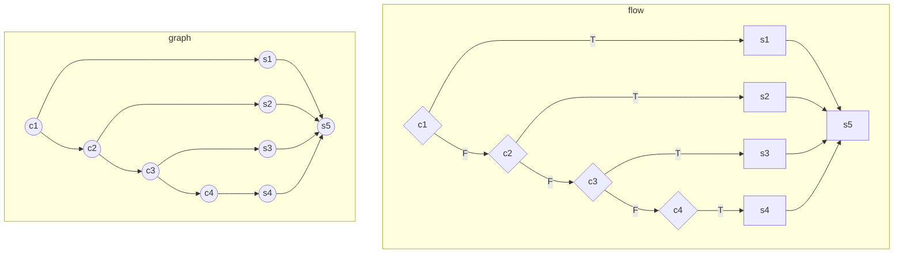
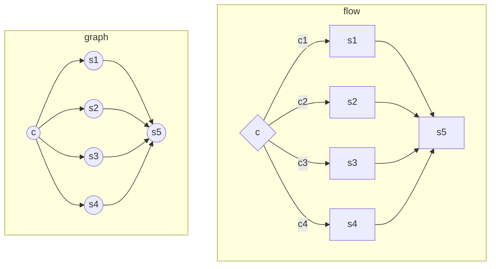
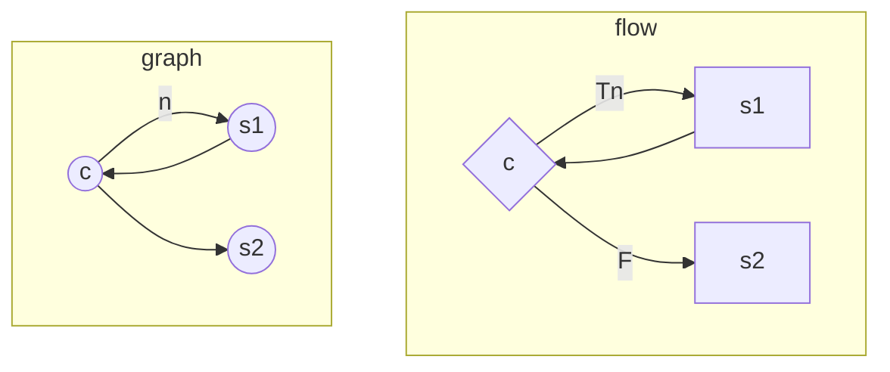
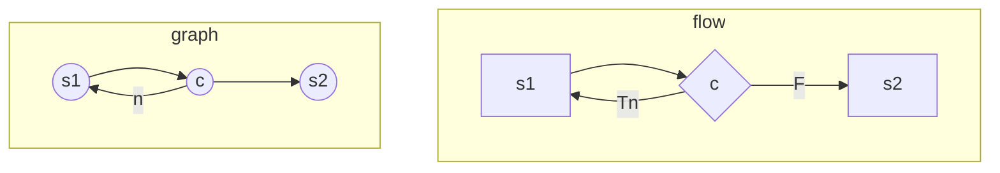

# Cyclomatic Complexity

## In graph theory

`V(G) = e - n + 2`

where

- `e`: the number of edges
- `n`: the number of nodes

## In a simple program

`V(G) = #BD + 1`

where `#BD` is the total binary decisions of the program.

- `If-else` is a two-way decision and counted as 1 binary decision
- `If-elif-else` is a three-way decision and counted as 2 binary decisions
- `swith-n-case` is an n-way decision and counted as n-1 binary decisions
- Each `condition of a loop` is counted as 1 binary decision

## Conditional code, flow, and graph association

### If

*Binary decision 1*

```js
if (c) {
    s1
}

s2
```



### If-else

*Binary decision 1*

```js
if (c) {
    s1
} else {
    s2
}

s3
```



### If-elif-else

*Binary decision 2*

```js
if (c1) {
    s1
} elif (c2)
    s2
} else {
    s3
}

s4
```



### switch-n-cases

*n-1 binary decisions*

switch-4-cases

```js
switch (n) {
    case c1:
        s1
        break
    case c2:
        s2
        break
    case c3:
        s3
        break
    case c4:
        s4
        break
}

s5
```



Or shorter



### Loops

*n-iterations + 1 binary decisions*

#### while and for

```
while (c) {
    s1
}

s2
```

```
for (;c;) {
    s1
}

s2
```



#### do-while

```
do {
    s1
} while (c)

s2
```



## Drawbacks

- Ignoring the complexity of sequential statements
- Do not distinguish different kinds of control flow complexity

## Applications

- Indicating the testability and understandability of a program/module/function
- Refactoring code by reducing the complexity of the conditional logic of a program/module/function